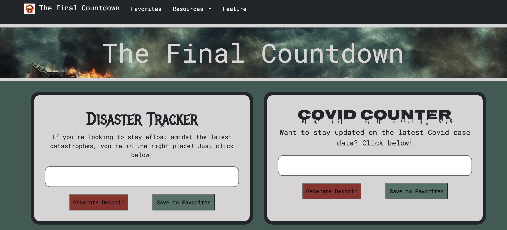
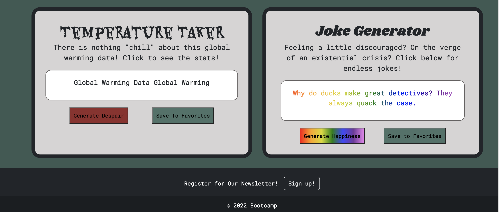

# The Final Countdown

## Description

The final countdown webpage is essentially an end-of-the-world (EOW) tracker. At first glance, the user will see multiple cards, each containing a different topic retaining to signs that the end is near. In one card, the user can click through recent natural disasters around the world. In other cards, the user will click through recent positive COVID numbers for each state, or click through data that tracks global warming. However, the last thing we want is for the user to leave feeling completely deflated by these recent events. So, the last card on the page allows the user to click through various jokes to help brighten the mood before the user leaves our page.
Along with cyling through various EOW data and jokes, the user can save said data points and jokes to reference later. By clicking the save button on any card, the data from that card will save in local storage and display on the favorites page.
Lastly, the user can access more details on such events by clicking on the links in the nav bar. These links will take the user right to the source of the data found on this website.

## Technology

The Final Countdown webpage uses the three languages we have learned in the first month of our bootcamp thus far: html, css and JavaScript. The webpage also incorporates web API’s, third-party API’s, and server-side API’s. Each card on the main page needed to fetch data from a third-party API and use that data to display information to the user after clicking the card’s generate button. When the user clicks the save button, the card needed to save the displayed information to the local storage. Then, when the user navigates to the favorites page, they will see the facts they saved from each card.

## Screenshot

## Link to deploy

https://canslercp.github.io/project_1/

## Resources

* Centers for Disease Control and Prevention, COVID-19 Response. COVID-19 Case Surveillance Public Use Data with Geography (version date: June 06, 2022).
* Catastrope.World
* icanhazdadjoke.com
* 

